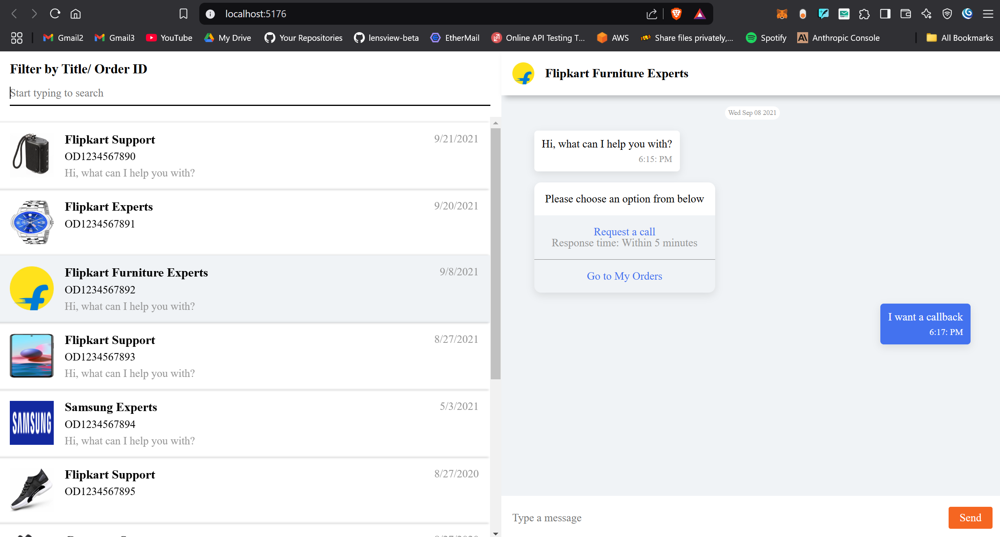
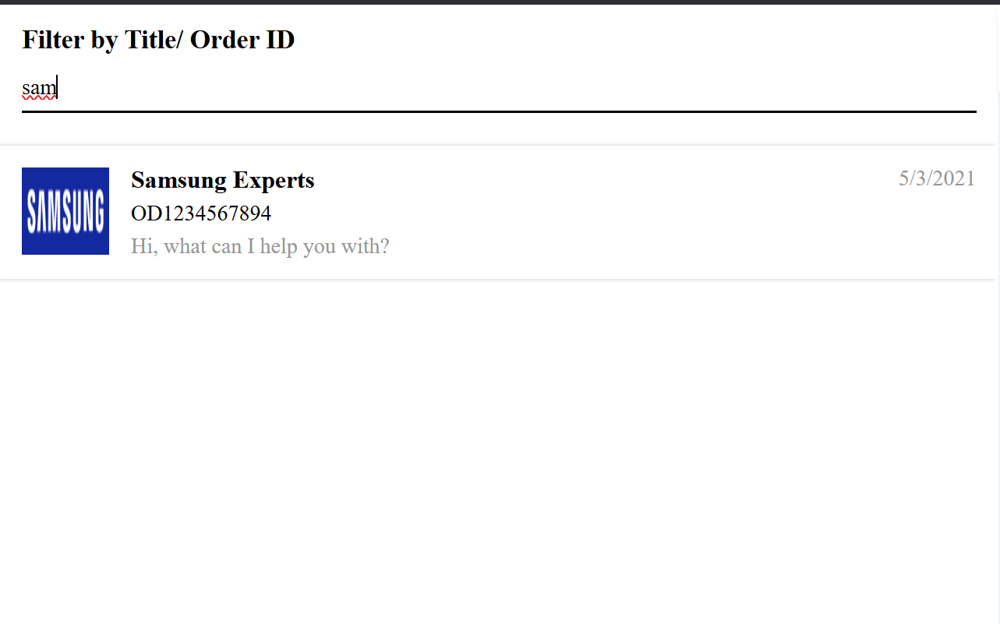
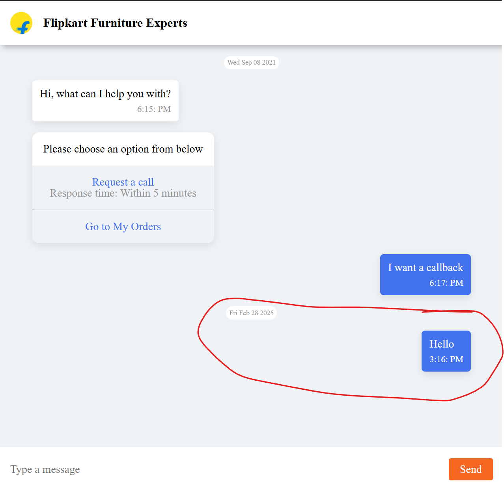

**Question:** https://docs.google.com/document/d/135tV0md3z9rvWpCdsKmLXGvmOWNM_BA9CotB8BhVyHQ/edit?usp=sharing





## API Response 
```json
[
      {
        "id": 1,
        "title": "Flipkart Support",
        "imageURL": "https://rukminim1.flixcart.com/image/300/300/k0vbgy80pkrrdj/speaker/mobile-tablet-speaker/4/n/n/boat-stone-grenade-original-imafg96ffpnpgdv4.jpeg?q=90",
        "orderId": "OD1234567890",
        "latestMessageTimestamp": 1632205237669,
        "messageList": [
          {
            "messageId": "msg1",
            "message": "Hi, what can I help you with?",
            "timestamp": 1632205137669,
            "sender": "BOT",
            "messageType": "text"
          },
          {
            "messageId": "msg2",
            "message": "Need help with this order",
            "timestamp": 1632205237669,
            "sender": "USER",
            "messageType": "text"
          }
        ]
      }
]
```
